# Sơ đồ Hệ thống — POS MasterV2

> Xem bằng VS Code + extension **"Markdown Preview Mermaid Support"**
> hoặc paste vào [mermaid.live](https://mermaid.live)

---

## 1. Kiến trúc tổng thể

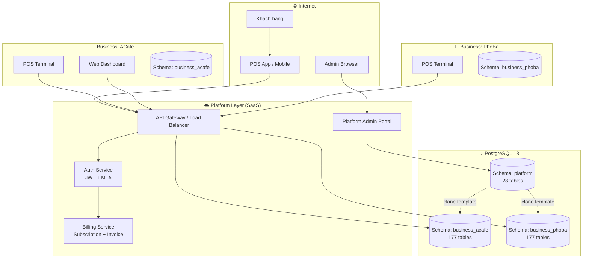
```mermaid
graph TB
    subgraph INTERNET["🌐 Internet"]
        UA[Admin Browser]
        UB[POS App / Mobile]
        UC[Khách hàng]
    end

    subgraph PLATFORM["☁️ Platform Layer (SaaS)"]
        direction TB
        API_GW[API Gateway / Load Balancer]
        AUTH[Auth Service\nJWT + MFA]
        BILLING[Billing Service\nSubscription + Invoice]
        ADMIN[Platform Admin Portal]
    end

    subgraph BUSINESS_A["🏪 Business: ACafe"]
        TA_POS[POS Terminal]
        TA_WEB[Web Dashboard]
        TA_DB[(Schema: business_acafe)]
    end

    subgraph BUSINESS_B["🍜 Business: PhoBa"]
        TB_POS[POS Terminal]
        TB_DB[(Schema: business_phoba)]
    end

    subgraph DATABASE["🗄️ PostgreSQL 18"]
        DB_PLATFORM[(Schema: platform\n28 tables)]
        DB_TA[(Schema: business_acafe\n177 tables)]
        DB_TB[(Schema: business_phoba\n177 tables)]
    end

    UA --> ADMIN
    UB --> API_GW
    UC --> UB

    API_GW --> AUTH
    AUTH --> BILLING
    ADMIN --> DB_PLATFORM

    TA_POS --> API_GW
    TA_WEB --> API_GW
    API_GW --> DB_TA

    TB_POS --> API_GW
    API_GW --> DB_TB

    DB_PLATFORM -.->|clone template| DB_TA
    DB_PLATFORM -.->|clone template| DB_TB
```

---

## 2. Use Case Diagram — Platform Admin

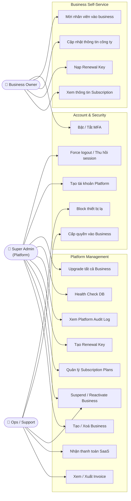
```mermaid
graph LR
    %% Actors
    SA(["👤 Super Admin\n(Platform)"])
    TA(["👤 Business Owner"])
    OPS(["👤 Ops / Support"])

    subgraph UC_PLATFORM["Platform Management"]
        UC1[Tạo / Xoá Business]
        UC2[Suspend / Reactivate Business]
        UC3[Quản lý Subscription Plans]
        UC4[Xem / Xuất Invoice]
        UC5[Nhận thanh toán SaaS]
        UC6[Tạo Renewal Key]
        UC7[Xem Platform Audit Log]
        UC8[Health Check DB]
        UC9[Upgrade tất cả Business]
    end

    subgraph UC_ACCOUNT["Account & Security"]
        UC10[Tạo tài khoản Platform]
        UC11[Cấp quyền vào Business]
        UC12[Force logout / Thu hồi session]
        UC13[Bật / Tắt MFA]
        UC14[Block thiết bị lạ]
    end

    subgraph UC_SELF["Business Self-Service"]
        UC15[Xem thông tin Subscription]
        UC16[Nạp Renewal Key]
        UC17[Cập nhật thông tin công ty]
        UC18[Mời nhân viên vào business]
    end

    SA --> UC1
    SA --> UC2
    SA --> UC3
    SA --> UC6
    SA --> UC7
    SA --> UC8
    SA --> UC9
    SA --> UC10
    SA --> UC12

    OPS --> UC4
    OPS --> UC5
    OPS --> UC2
    OPS --> UC11
    OPS --> UC14

    TA --> UC15
    TA --> UC16
    TA --> UC17
    TA --> UC18
    TA --> UC13
```

---

## 3. Use Case Diagram — Nghiệp vụ Business (POS)

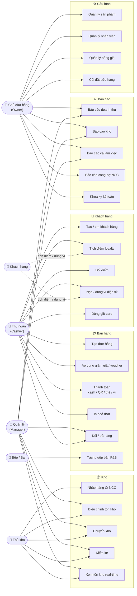
```mermaid
graph LR
    %% Actors
    OWNER(["👤 Chủ cửa hàng\n(Owner)"])
    MGR(["👤 Quản lý\n(Manager)"])
    CSH(["👤 Thu ngân\n(Cashier)"])
    WH(["👤 Thủ kho"])
    KIT(["👤 Bếp / Bar"])
    CUS(["👔 Khách hàng"])

    subgraph UC_SALES["💳 Bán hàng"]
        S1[Tạo đơn hàng]
        S2[Áp dụng giảm giá / voucher]
        S3[Thanh toán\ncash / QR / thẻ / ví]
        S4[In hoá đơn]
        S5[Đổi / trả hàng]
        S6[Tách / gộp bàn F&B]
    end

    subgraph UC_INV["📦 Kho"]
        I1[Nhập hàng từ NCC]
        I2[Điều chỉnh tồn kho]
        I3[Chuyển kho]
        I4[Kiểm kê]
        I5[Xem tồn kho real-time]
    end

    subgraph UC_CRM["🤝 Khách hàng"]
        C1[Tạo / tìm khách hàng]
        C2[Tích điểm loyalty]
        C3[Đổi điểm]
        C4[Nạp / dùng ví điện tử]
        C5[Dùng gift card]
    end

    subgraph UC_RPT["📊 Báo cáo"]
        R1[Báo cáo doanh thu]
        R2[Báo cáo kho]
        R3[Báo cáo ca làm việc]
        R4[Báo cáo công nợ NCC]
        R5[Khoá kỳ kế toán]
    end

    subgraph UC_CFG["⚙️ Cấu hình"]
        F1[Quản lý sản phẩm]
        F2[Quản lý nhân viên]
        F3[Quản lý bảng giá]
        F4[Cài đặt cửa hàng]
    end

    OWNER --> F1 & F2 & F3 & F4
    OWNER --> R1 & R2 & R3 & R4 & R5

    MGR --> R1 & R2 & R3
    MGR --> I2 & I3 & I4 & I5
    MGR --> S5

    CSH --> S1 & S2 & S3 & S4 & S5
    CSH --> C1 & C2 & C3 & C4 & C5

    WH --> I1 & I2 & I3 & I4 & I5

    KIT --> S6

    CUS -.->|tích điểm / dùng ví| C2 & C4
```

---

## 4. Luồng nghiệp vụ — Vòng đời Business

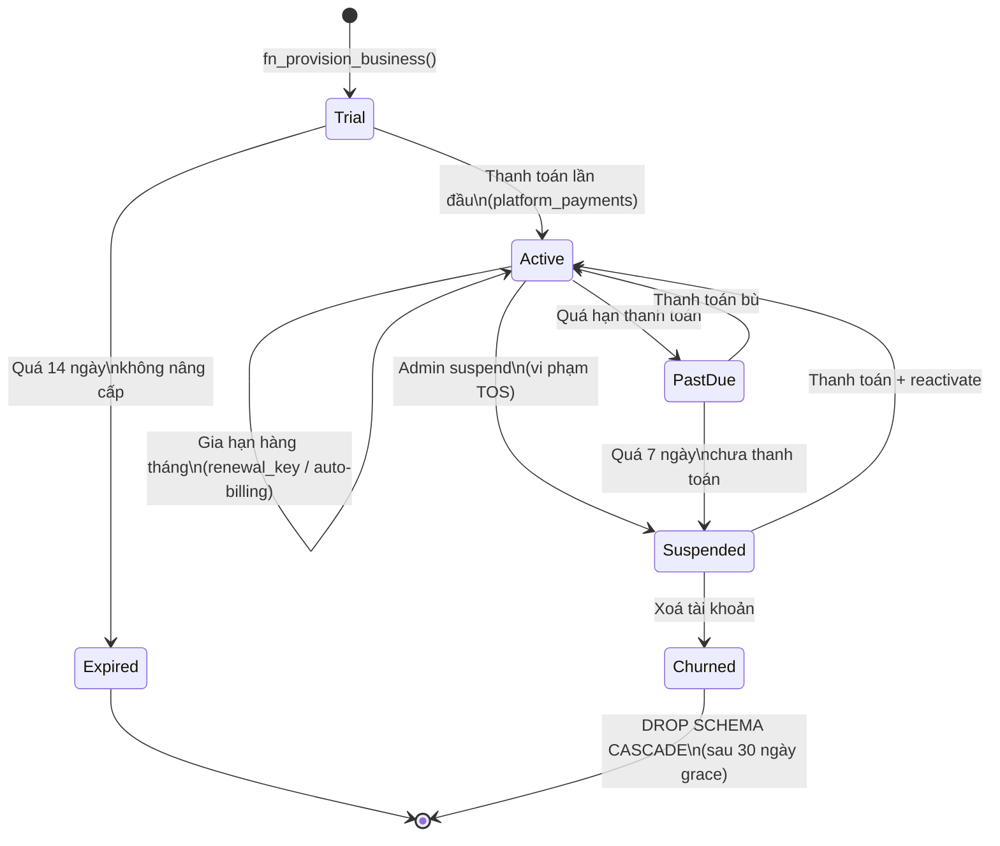
```mermaid
stateDiagram-v2
    [*] --> Trial : fn_provision_business()

    Trial --> Active : Thanh toán lần đầu\n(platform_payments)
    Trial --> Expired : Quá 14 ngày\nkhông nâng cấp

    Active --> Active : Gia hạn hàng tháng\n(renewal_key / auto-billing)
    Active --> PastDue : Quá hạn thanh toán
    Active --> Suspended : Admin suspend\n(vi phạm TOS)

    PastDue --> Active : Thanh toán bù
    PastDue --> Suspended : Quá 7 ngày\nchưa thanh toán

    Suspended --> Active : Thanh toán + reactivate
    Suspended --> Churned : Xoá tài khoản

    Expired --> [*]
    Churned --> [*] : DROP SCHEMA CASCADE\n(sau 30 ngày grace)
```

---

## 5. Luồng bán hàng — Sales Order Flow

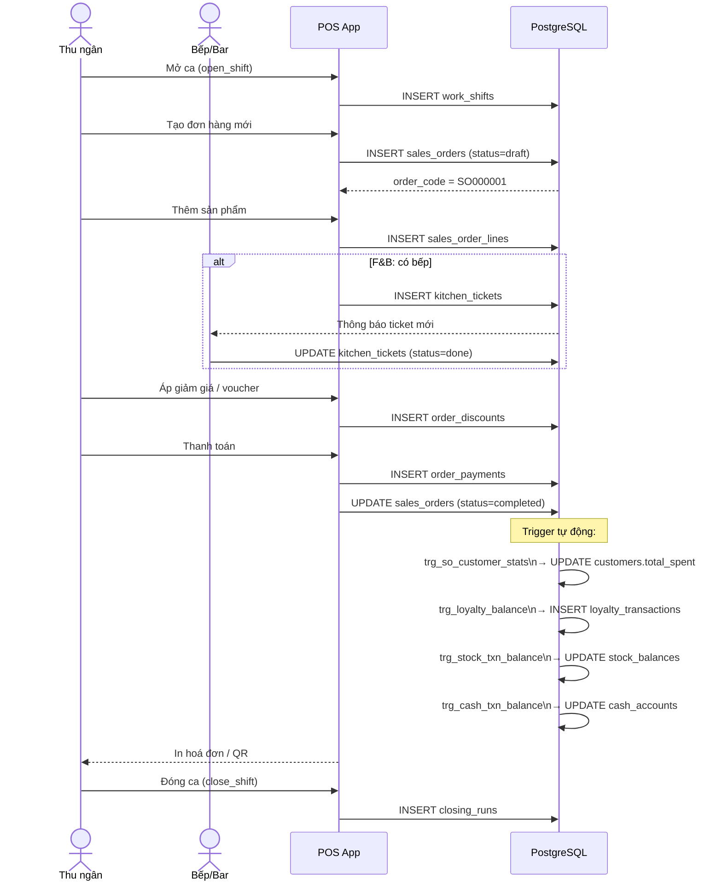
```mermaid
sequenceDiagram
    actor CSH as Thu ngân
    actor KIT as Bếp/Bar
    participant POS as POS App
    participant DB as PostgreSQL

    CSH->>POS: Mở ca (open_shift)
    POS->>DB: INSERT work_shifts

    CSH->>POS: Tạo đơn hàng mới
    POS->>DB: INSERT sales_orders (status=draft)
    DB-->>POS: order_code = SO000001

    CSH->>POS: Thêm sản phẩm
    POS->>DB: INSERT sales_order_lines

    alt F&B: có bếp
        POS->>DB: INSERT kitchen_tickets
        DB-->>KIT: Thông báo ticket mới
        KIT->>DB: UPDATE kitchen_tickets (status=done)
    end

    CSH->>POS: Áp giảm giá / voucher
    POS->>DB: INSERT order_discounts

    CSH->>POS: Thanh toán
    POS->>DB: INSERT order_payments
    POS->>DB: UPDATE sales_orders (status=completed)

    Note over DB: Trigger tự động:
    DB->>DB: trg_so_customer_stats\n→ UPDATE customers.total_spent
    DB->>DB: trg_loyalty_balance\n→ INSERT loyalty_transactions
    DB->>DB: trg_stock_txn_balance\n→ UPDATE stock_balances
    DB->>DB: trg_cash_txn_balance\n→ UPDATE cash_accounts

    POS-->>CSH: In hoá đơn / QR
    CSH->>POS: Đóng ca (close_shift)
    POS->>DB: INSERT closing_runs
```

---

## 6. Luồng nhập hàng — Purchase Order Flow

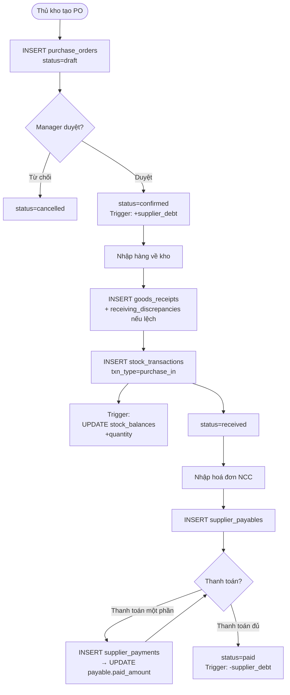
```mermaid
flowchart TD
    A([Thủ kho tạo PO]) --> B[INSERT purchase_orders\nstatus=draft]
    B --> C{Manager duyệt?}
    C -->|Từ chối| D[status=cancelled]
    C -->|Duyệt| E[status=confirmed\nTrigger: +supplier_debt]

    E --> F[Nhập hàng về kho]
    F --> G[INSERT goods_receipts\n+ receiving_discrepancies nếu lệch]
    G --> H[INSERT stock_transactions\ntxn_type=purchase_in]

    H --> I[Trigger:\nUPDATE stock_balances\n+quantity]
    H --> J[status=received]

    J --> K[Nhập hoá đơn NCC]
    K --> L[INSERT supplier_payables]
    L --> M{Thanh toán?}
    M -->|Thanh toán một phần| N[INSERT supplier_payments\n→ UPDATE payable.paid_amount]
    M -->|Thanh toán đủ| O[status=paid\nTrigger: -supplier_debt]
    N --> M
```

---

## 7. Luồng xác thực — Authentication Flow

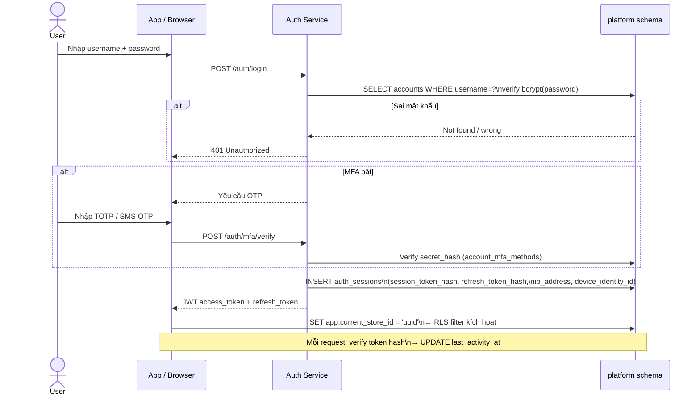
```mermaid
sequenceDiagram
    actor U as User
    participant APP as App / Browser
    participant AUTH as Auth Service
    participant DB as platform schema

    U->>APP: Nhập username + password
    APP->>AUTH: POST /auth/login

    AUTH->>DB: SELECT accounts WHERE username=?\nverify bcrypt(password)

    alt Sai mật khẩu
        DB-->>AUTH: Not found / wrong
        AUTH-->>APP: 401 Unauthorized
    end

    alt MFA bật
        AUTH-->>APP: Yêu cầu OTP
        U->>APP: Nhập TOTP / SMS OTP
        APP->>AUTH: POST /auth/mfa/verify
        AUTH->>DB: Verify secret_hash (account_mfa_methods)
    end

    AUTH->>DB: INSERT auth_sessions\n(session_token_hash, refresh_token_hash,\nip_address, device_identity_id)

    AUTH-->>APP: JWT access_token + refresh_token

    APP->>DB: SET app.current_store_id = 'uuid'\n← RLS filter kích hoạt

    Note over APP,DB: Mỗi request: verify token hash\n→ UPDATE last_activity_at
```

---

## 8. Luồng billing — SaaS Subscription

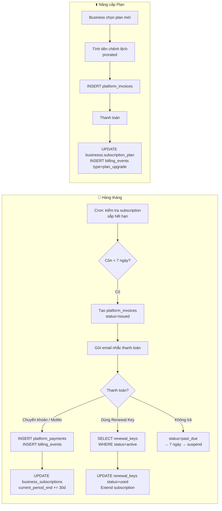
```mermaid
flowchart LR
    subgraph MONTHLY["🔄 Hàng tháng"]
        direction TB
        A[Cron: kiểm tra subscription\nsắp hết hạn] --> B{Còn < 7 ngày?}
        B -->|Có| C[Tạo platform_invoices\nstatus=issued]
        C --> D[Gửi email nhắc thanh toán]
        D --> E{Thanh toán?}
        E -->|Chuyển khoản / MoMo| F[INSERT platform_payments\nINSERT billing_events]
        F --> G[UPDATE business_subscriptions\ncurrent_period_end += 30d]
        E -->|Dùng Renewal Key| H[SELECT renewal_keys\nWHERE status=active]
        H --> I[UPDATE renewal_keys status=used\nExtend subscription]
        E -->|Không trả| J[status=past_due\n→ 7 ngày → suspend]
    end

    subgraph UPGRADE["⬆️ Nâng cấp Plan"]
        direction TB
        U1[Business chọn plan mới] --> U2[Tính tiền chênh lệch\nprorated]
        U2 --> U3[INSERT platform_invoices]
        U3 --> U4[Thanh toán]
        U4 --> U5[UPDATE businesss.subscription_plan\nINSERT billing_events type=plan_upgrade]
    end
```

---

## 9. Phân quyền RBAC — Role & Permission

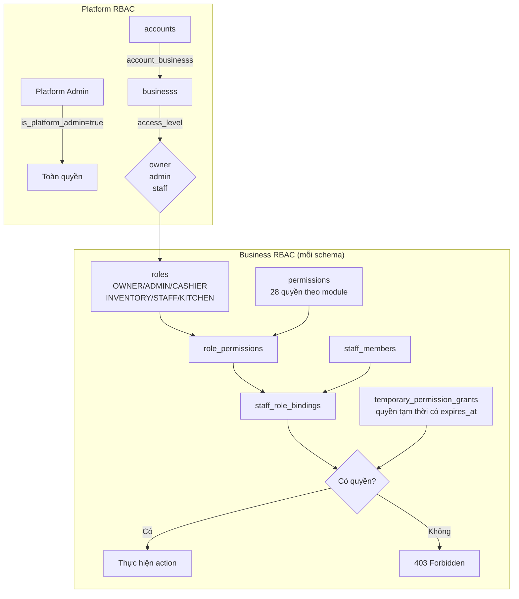
```mermaid
graph TD
    subgraph PLATFORM_RBAC["Platform RBAC"]
        PA[Platform Admin] -->|is_platform_admin=true| ALL[Toàn quyền]
        ACC[accounts] -->|account_businesss| TEN[businesss]
        TEN -->|access_level| AL{"owner\nadmin\nstaff"}
    end

    subgraph BUSINESS_RBAC["Business RBAC (mỗi schema)"]
        ROLE[roles\nOWNER/ADMIN/CASHIER\nINVENTORY/STAFF/KITCHEN] --> RP[role_permissions]
        PERM[permissions\n28 quyền theo module] --> RP
        RP --> SRB[staff_role_bindings]
        STAFF[staff_members] --> SRB
        SRB --> CHECK{Có quyền?}
        CHECK -->|Có| ACTION[Thực hiện action]
        CHECK -->|Không| DENY[403 Forbidden]

        TEMP[temporary_permission_grants\nquyền tạm thời có expires_at] --> CHECK
    end

    AL --> ROLE
```

---

## 10. Trigger dependencies — Data flow tự động

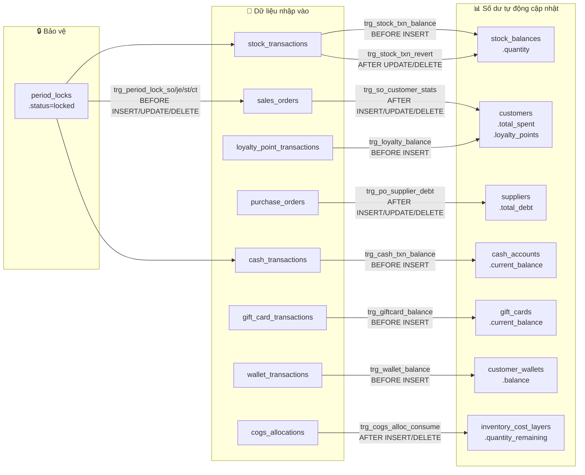
```mermaid
graph LR
    subgraph INPUTS["📝 Dữ liệu nhập vào"]
        ST[stock_transactions]
        SO[sales_orders]
        PO[purchase_orders]
        CT[cash_transactions]
        GCT[gift_card_transactions]
        WT[wallet_transactions]
        LT[loyalty_point_transactions]
        CA[cogs_allocations]
    end

    subgraph BALANCES["📊 Số dư tự động cập nhật"]
        SB[stock_balances\n.quantity]
        CS[customers\n.total_spent\n.loyalty_points]
        SUP[suppliers\n.total_debt]
        CASH[cash_accounts\n.current_balance]
        GC[gift_cards\n.current_balance]
        WAL[customer_wallets\n.balance]
        COST[inventory_cost_layers\n.quantity_remaining]
    end

    subgraph GUARD["🔒 Bảo vệ"]
        PL[period_locks\n.status=locked]
    end

    ST -->|trg_stock_txn_balance\nBEFORE INSERT| SB
    ST -->|trg_stock_txn_revert\nAFTER UPDATE/DELETE| SB
    SO -->|trg_so_customer_stats\nAFTER INSERT/UPDATE/DELETE| CS
    PO -->|trg_po_supplier_debt\nAFTER INSERT/UPDATE/DELETE| SUP
    CT -->|trg_cash_txn_balance\nBEFORE INSERT| CASH
    GCT -->|trg_giftcard_balance\nBEFORE INSERT| GC
    WT -->|trg_wallet_balance\nBEFORE INSERT| WAL
    LT -->|trg_loyalty_balance\nBEFORE INSERT| CS
    CA -->|trg_cogs_alloc_consume\nAFTER INSERT/DELETE| COST

    PL -->|trg_period_lock_so/je/st/ct\nBEFORE INSERT/UPDATE/DELETE| SO
    PL --> ST
    PL --> CT
```

---

## 11. Luồng đổi / trả hàng — Return & Refund Flow

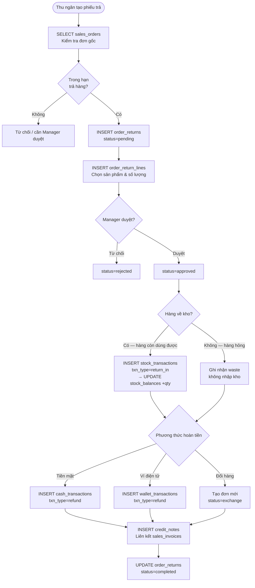
```mermaid
flowchart TD
    A([Thu ngân tạo phiếu trả]) --> B[SELECT sales_orders\nKiểm tra đơn gốc]
    B --> C{Trong hạn\ntrả hàng?}
    C -->|Không| D[Từ chối / cần Manager duyệt]
    C -->|Có| E[INSERT order_returns\nstatus=pending]

    E --> F[INSERT order_return_lines\nChọn sản phẩm & số lượng]
    F --> G{Manager duyệt?}
    G -->|Từ chối| H[status=rejected]
    G -->|Duyệt| I[status=approved]

    I --> J{Hàng về kho?}
    J -->|Có — hàng còn dùng được| K[INSERT stock_transactions\ntxn_type=return_in\n→ UPDATE stock_balances +qty]
    J -->|Không — hàng hỏng| L[Ghi nhận waste\nkhông nhập kho]

    K & L --> M{Phương thức hoàn tiền}
    M -->|Tiền mặt| N[INSERT cash_transactions\ntxn_type=refund]
    M -->|Ví điện tử| O[INSERT wallet_transactions\ntxn_type=refund]
    M -->|Đổi hàng| P[Tạo đơn mới\nstatus=exchange]

    N & O & P --> Q[INSERT credit_notes\nLiên kết sales_invoices]
    Q --> R[UPDATE order_returns\nstatus=completed]
```

---

## 12. Luồng HR — Chấm công & Tính lương

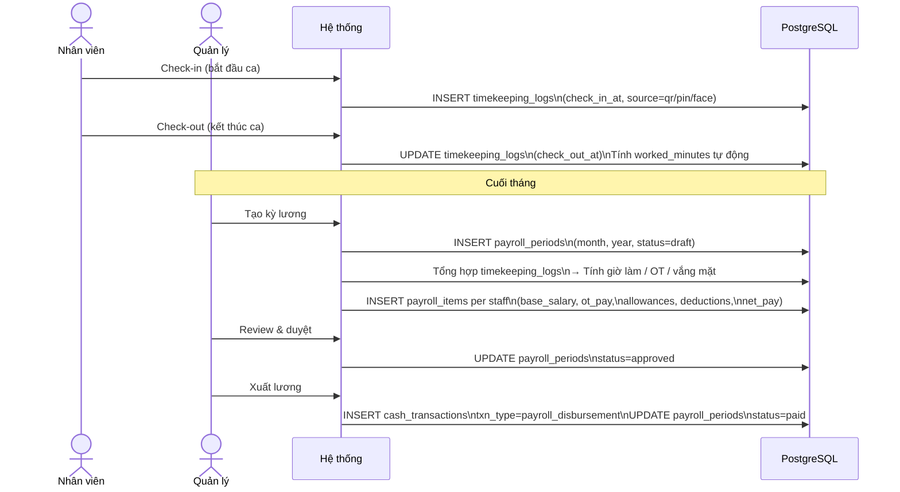
```mermaid
sequenceDiagram
    actor STF as Nhân viên
    actor MGR as Quản lý
    participant SYS as Hệ thống
    participant DB as PostgreSQL

    STF->>SYS: Check-in (bắt đầu ca)
    SYS->>DB: INSERT timekeeping_logs\n(check_in_at, source=qr/pin/face)

    STF->>SYS: Check-out (kết thúc ca)
    SYS->>DB: UPDATE timekeeping_logs\n(check_out_at)\nTính worked_minutes tự động

    Note over MGR,DB: Cuối tháng
    MGR->>SYS: Tạo kỳ lương
    SYS->>DB: INSERT payroll_periods\n(month, year, status=draft)

    SYS->>DB: Tổng hợp timekeeping_logs\n→ Tính giờ làm / OT / vắng mặt

    SYS->>DB: INSERT payroll_items per staff\n(base_salary, ot_pay,\nallowances, deductions,\nnet_pay)

    MGR->>SYS: Review & duyệt
    SYS->>DB: UPDATE payroll_periods\nstatus=approved

    MGR->>SYS: Xuất lương
    SYS->>DB: INSERT cash_transactions\ntxn_type=payroll_disbursement\nUPDATE payroll_periods\nstatus=paid
```

---

## 13. Luồng kiểm kê kho — Stocktake Flow

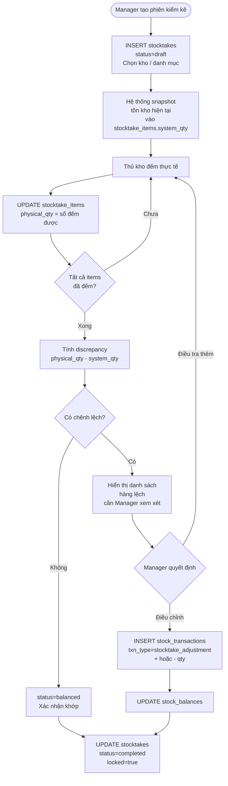
```mermaid
flowchart TD
    A([Manager tạo phiên kiểm kê]) --> B[INSERT stocktakes\nstatus=draft\nChọn kho / danh mục]
    B --> C[Hệ thống snapshot\ntồn kho hiện tại\nvào stocktake_items.system_qty]

    C --> D[Thủ kho đếm thực tế]
    D --> E[UPDATE stocktake_items\nphysical_qty = số đếm được]

    E --> F{Tất cả items\nđã đếm?}
    F -->|Chưa| D
    F -->|Xong| G[Tính discrepancy\nphysical_qty - system_qty]

    G --> H{Có chênh lệch?}
    H -->|Không| I[status=balanced\nXác nhận khớp]
    H -->|Có| J[Hiển thị danh sách\nhàng lệch\ncần Manager xem xét]

    J --> K{Manager quyết định}
    K -->|Điều chỉnh| L[INSERT stock_transactions\ntxn_type=stocktake_adjustment\n+ hoặc - qty]
    K -->|Điều tra thêm| D

    L --> M[UPDATE stock_balances]
    M --> N[UPDATE stocktakes\nstatus=completed\nlocked=true]
    I --> N
```

---

## 14. Luồng chuyển kho — Stock Transfer Flow

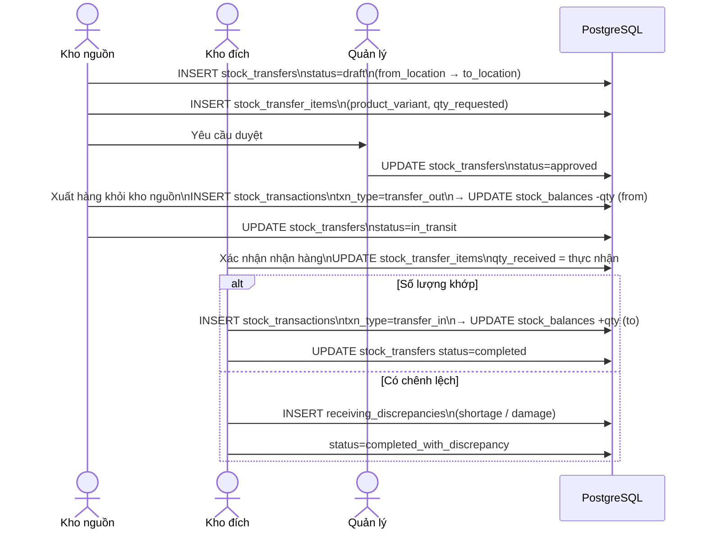
```mermaid
sequenceDiagram
    actor WH1 as Kho nguồn
    actor WH2 as Kho đích
    actor MGR as Quản lý
    participant DB as PostgreSQL

    WH1->>DB: INSERT stock_transfers\nstatus=draft\n(from_location → to_location)
    WH1->>DB: INSERT stock_transfer_items\n(product_variant, qty_requested)

    WH1->>MGR: Yêu cầu duyệt
    MGR->>DB: UPDATE stock_transfers\nstatus=approved

    WH1->>DB: Xuất hàng khỏi kho nguồn\nINSERT stock_transactions\ntxn_type=transfer_out\n→ UPDATE stock_balances -qty (from)

    WH1->>DB: UPDATE stock_transfers\nstatus=in_transit

    WH2->>DB: Xác nhận nhận hàng\nUPDATE stock_transfer_items\nqty_received = thực nhận

    alt Số lượng khớp
        WH2->>DB: INSERT stock_transactions\ntxn_type=transfer_in\n→ UPDATE stock_balances +qty (to)
        WH2->>DB: UPDATE stock_transfers status=completed
    else Có chênh lệch
        WH2->>DB: INSERT receiving_discrepancies\n(shortage / damage)
        WH2->>DB: status=completed_with_discrepancy
    end
```

---

## 15. Luồng đối soát ca — Shift Cash Reconciliation

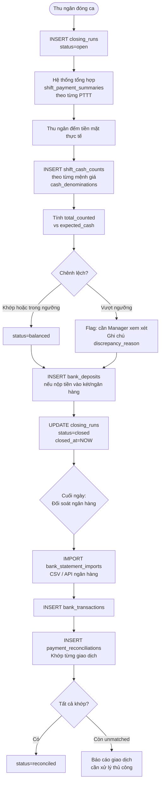
```mermaid
flowchart TD
    A([Thu ngân đóng ca]) --> B[INSERT closing_runs\nstatus=open]
    B --> C[Hệ thống tổng hợp\nshift_payment_summaries\ntheo từng PTTT]

    C --> D[Thu ngân đếm tiền mặt thực tế]
    D --> E[INSERT shift_cash_counts\ntheo từng mệnh giá\ncash_denominations]

    E --> F[Tính total_counted\nvs expected_cash]
    F --> G{Chênh lệch?}
    G -->|Khớp hoặc trong ngưỡng| H[status=balanced]
    G -->|Vượt ngưỡng| I[Flag: cần Manager xem xét\nGhi chú discrepancy_reason]

    H & I --> J[INSERT bank_deposits\nnếu nộp tiền vào két/ngân hàng]

    J --> K["UPDATE closing_runs\nstatus=closed\nclosed_at=NOW"]

    K --> L{Cuối ngày:\nĐối soát ngân hàng}
    L --> M[IMPORT bank_statement_imports\nCSV / API ngân hàng]
    M --> N[INSERT bank_transactions]
    N --> O[INSERT payment_reconciliations\nKhớp từng giao dịch]
    O --> P{Tất cả khớp?}
    P -->|Có| Q[status=reconciled]
    P -->|Còn unmatched| R[Báo cáo giao dịch\ncần xử lý thủ công]
```

---

## 16. Luồng hoá đơn thuế & Credit Note

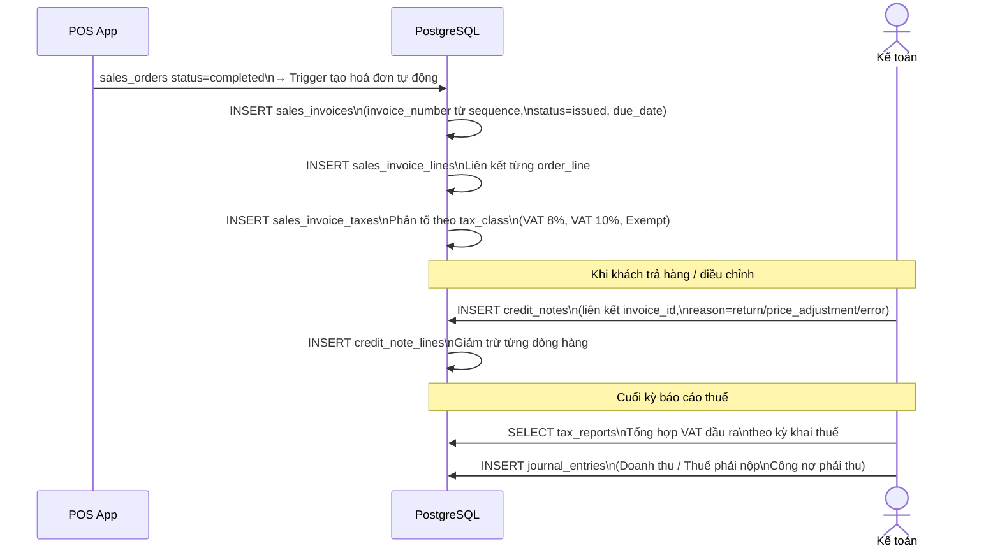
```mermaid
sequenceDiagram
    participant POS as POS App
    participant DB as PostgreSQL
    actor ACC as Kế toán

    POS->>DB: sales_orders status=completed\n→ Trigger tạo hoá đơn tự động

    DB->>DB: INSERT sales_invoices\n(invoice_number từ sequence,\nstatus=issued, due_date)
    DB->>DB: INSERT sales_invoice_lines\nLiên kết từng order_line
    DB->>DB: INSERT sales_invoice_taxes\nPhân tổ theo tax_class\n(VAT 8%, VAT 10%, Exempt)

    Note over ACC,DB: Khi khách trả hàng / điều chỉnh
    ACC->>DB: INSERT credit_notes\n(liên kết invoice_id,\nreason=return/price_adjustment/error)
    DB->>DB: INSERT credit_note_lines\nGiảm trừ từng dòng hàng

    Note over ACC,DB: Cuối kỳ báo cáo thuế
    ACC->>DB: SELECT tax_reports\nTổng hợp VAT đầu ra\ntheo kỳ khai thuế

    ACC->>DB: INSERT journal_entries\n(Doanh thu / Thuế phải nộp\nCông nợ phải thu)
```

---

## 17. Luồng chi phí nhập hàng — Landed Cost & COGS

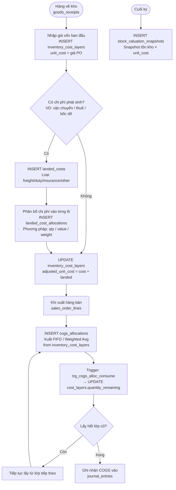
```mermaid
flowchart TD
    A([Hàng về kho\ngoods_receipts]) --> B[Nhập giá vốn ban đầu\nINSERT inventory_cost_layers\nunit_cost = giá PO]

    B --> C{Có chi phí phát sinh?\nVD: vận chuyển / thuế / bốc dỡ}
    C -->|Không| F
    C -->|Có| D[INSERT landed_costs\nLoại: freight/duty/insurance/other]

    D --> E[Phân bổ chi phí vào từng lô\nINSERT landed_cost_allocations\nPhương pháp: qty / value / weight]
    E --> F[UPDATE inventory_cost_layers\nadjusted_unit_cost = cost + landed]

    F --> G[Khi xuất hàng bán\nsales_order_lines]
    G --> H[INSERT cogs_allocations\nXuất FIFO / Weighted Avg\nfrom inventory_cost_layers]

    H --> I[Trigger: trg_cogs_alloc_consume\n→ UPDATE cost_layers.quantity_remaining]

    I --> J{Lấy hết lớp cũ?}
    J -->|Còn| K[Tiếp tục lấy từ lớp tiếp theo]
    J -->|Xong| L[Ghi nhận COGS vào\njournal_entries]

    K --> H

    M([Cuối kỳ]) --> N[INSERT stock_valuation_snapshots\nSnapshot tồn kho × unit_cost]
```

---

## 18. Luồng Loyalty, Ví & Gift Card

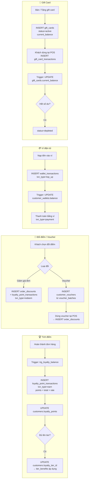
```mermaid
flowchart LR
    subgraph EARN["🏆 Tích điểm"]
        direction TB
        A1[Hoàn thành đơn hàng] --> A2[Trigger: trg_loyalty_balance]
        A2 --> A3[INSERT loyalty_point_transactions\ntxn_type=earn\npoints = total × rate]
        A3 --> A4[UPDATE customers.loyalty_points]
        A4 --> A5{Đủ lên tier?}
        A5 -->|Có| A6[UPDATE customers.loyalty_tier_id\n→ tier_benefits áp dụng]
    end

    subgraph REDEEM["🎁 Đổi điểm / Voucher"]
        direction TB
        B1[Khách chọn đổi điểm] --> B2{Loại đổi}
        B2 -->|Giảm giá đơn| B3[INSERT order_discounts\n+ loyalty_point_transactions\ntxn_type=redeem]
        B2 -->|Voucher| B4[INSERT customer_vouchers\ntừ voucher_batches]
        B4 --> B5[Dùng voucher tại POS\n→ INSERT order_discounts]
    end

    subgraph WALLET["💳 Ví điện tử"]
        direction TB
        C1[Nạp tiền vào ví] --> C2[INSERT wallet_transactions\ntxn_type=top_up]
        C2 --> C3[Trigger: UPDATE\ncustomer_wallets.balance]
        C3 --> C4[Thanh toán bằng ví\ntxn_type=payment]
    end

    subgraph GIFTCARD["🎫 Gift Card"]
        direction TB
        D1[Bán / Tặng gift card] --> D2[INSERT gift_cards\nstatus=active\ncurrent_balance]
        D2 --> D3[Khách dùng tại POS\nINSERT gift_card_transactions]
        D3 --> D4[Trigger: UPDATE\ngift_cards.current_balance]
        D4 --> D5{Hết số dư?}
        D5 -->|Có| D6[status=depleted]
    end
```

---

## 19. Luồng giao hàng — Shipping & Fulfillment

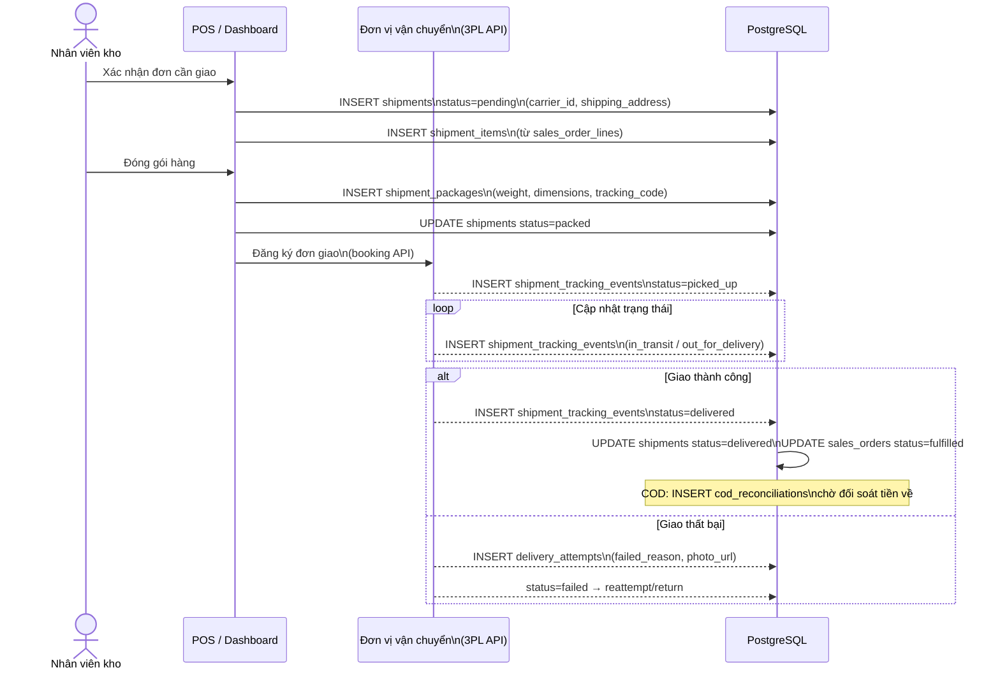
```mermaid
sequenceDiagram
    actor STF as Nhân viên kho
    participant POS as POS / Dashboard
    participant CARRIER as Đơn vị vận chuyển\n(3PL API)
    participant DB as PostgreSQL

    STF->>POS: Xác nhận đơn cần giao
    POS->>DB: INSERT shipments\nstatus=pending\n(carrier_id, shipping_address)
    POS->>DB: INSERT shipment_items\n(từ sales_order_lines)

    STF->>POS: Đóng gói hàng
    POS->>DB: INSERT shipment_packages\n(weight, dimensions, tracking_code)
    POS->>DB: UPDATE shipments status=packed

    POS->>CARRIER: Đăng ký đơn giao\n(booking API)
    CARRIER-->>DB: INSERT shipment_tracking_events\nstatus=picked_up

    loop Cập nhật trạng thái
        CARRIER-->>DB: INSERT shipment_tracking_events\n(in_transit / out_for_delivery)
    end

    alt Giao thành công
        CARRIER-->>DB: INSERT shipment_tracking_events\nstatus=delivered
        DB->>DB: UPDATE shipments status=delivered\nUPDATE sales_orders status=fulfilled
        Note over DB: COD: INSERT cod_reconciliations\nchờ đối soát tiền về
    else Giao thất bại
        CARRIER-->>DB: INSERT delivery_attempts\n(failed_reason, photo_url)
        CARRIER-->>DB: status=failed → reattempt/return
    end
```

---

## 20. Luồng dịch vụ & bảo hành — Service & Warranty

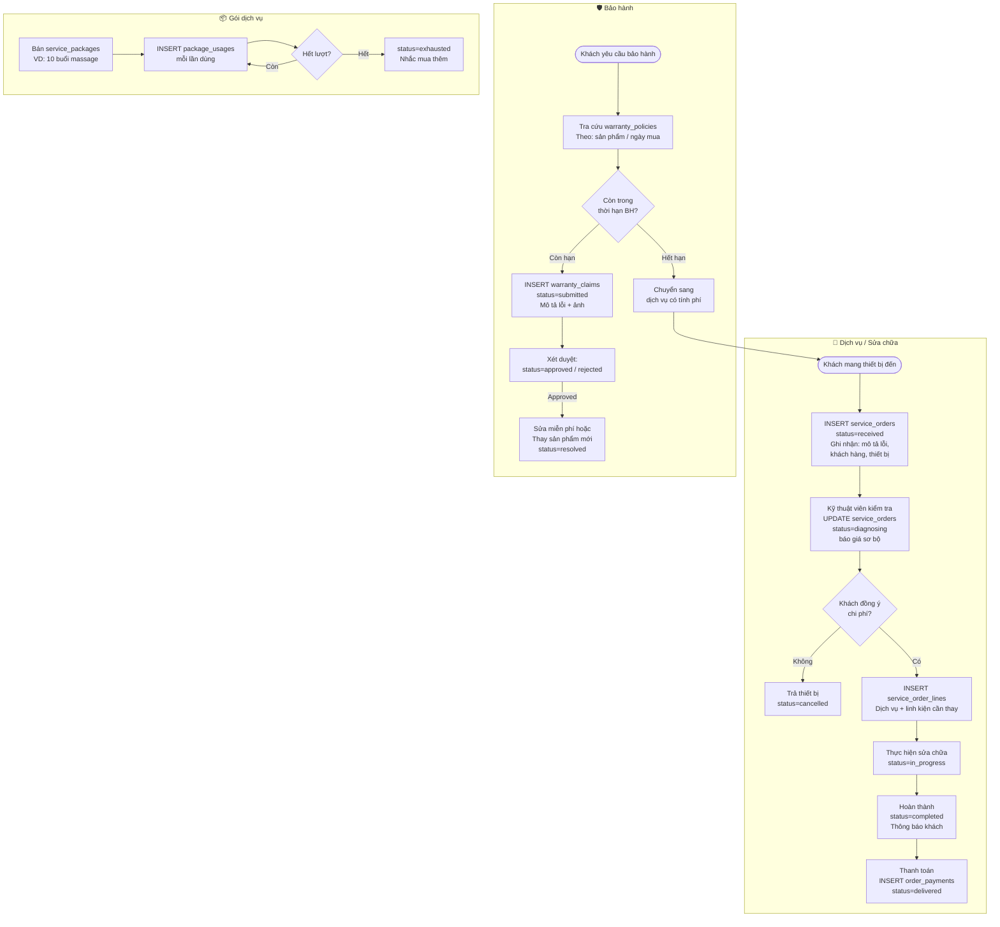
```mermaid
flowchart TD
    subgraph SERVICE["🔧 Dịch vụ / Sửa chữa"]
        A([Khách mang thiết bị đến]) --> B[INSERT service_orders\nstatus=received\nGhi nhận: mô tả lỗi,\nkhách hàng, thiết bị]
        B --> C[Kỹ thuật viên kiểm tra\nUPDATE service_orders\nstatus=diagnosing\nbáo giá sơ bộ]
        C --> D{Khách đồng ý\nchi phí?}
        D -->|Không| E[Trả thiết bị\nstatus=cancelled]
        D -->|Có| F[INSERT service_order_lines\nDịch vụ + linh kiện cần thay]
        F --> G[Thực hiện sửa chữa\nstatus=in_progress]
        G --> H[Hoàn thành\nstatus=completed\nThông báo khách]
        H --> I[Thanh toán\nINSERT order_payments\nstatus=delivered]
    end

    subgraph WARRANTY["🛡️ Bảo hành"]
        W1([Khách yêu cầu bảo hành]) --> W2[Tra cứu warranty_policies\nTheo: sản phẩm / ngày mua]
        W2 --> W3{Còn trong\nthời hạn BH?}
        W3 -->|Hết hạn| W4[Chuyển sang\ndịch vụ có tính phí]
        W3 -->|Còn hạn| W5[INSERT warranty_claims\nstatus=submitted\nMô tả lỗi + ảnh]
        W5 --> W6[Xét duyệt:\nstatus=approved / rejected]
        W6 -->|Approved| W7[Sửa miễn phí hoặc\nThay sản phẩm mới\nstatus=resolved]
    end

    subgraph PACKAGE["📦 Gói dịch vụ"]
        P1[Bán service_packages\nVD: 10 buổi massage] --> P2[INSERT package_usages\nmỗi lần dùng]
        P2 --> P3{Hết lượt?}
        P3 -->|Còn| P2
        P3 -->|Hết| P4[status=exhausted\nNhắc mua thêm]
    end

    W4 --> A
```

---

## 21. Luồng Marketing & Campaign

```mermaid
flowchart TD
    subgraph SEGMENT["👥 Phân khúc khách hàng"]
        A1[Định nghĩa customer_segments\nLọc theo: RFM / tag / tier /\nkhu vực / lịch sử mua] --> A2[INSERT customer_tag_mappings\nGán tag tự động hoặc thủ công]
        A2 --> A3[Kiểm tra consent\ncustomer_consents\n+ customer_contact_preferences]
    end

    subgraph CAMPAIGN["📣 Chiến dịch"]
        B1[INSERT campaigns\ntype: email/sms/push/zalo\nschedule_at, target_segment] --> B2{Phương thức gửi}
        B2 -->|Ngay| B3[status=running]
        B2 -->|Lên lịch| B4[Cron kích hoạt\nkhi đến schedule_at]
        B4 --> B3

        B3 --> B5[INSERT campaign_messages\nper customer trong segment\nstatus=queued]
        B5 --> B6[Gửi qua\nEmail / SMS / Push gateway]
        B6 --> B7{Kết quả}
        B7 -->|Thành công| B8[status=delivered\ntracked_at]
        B7 -->|Thất bại| B9[status=failed\nretry_count++]
        B9 -->|Retry < 3| B6
        B9 -->|Retry >= 3| B10[status=permanently_failed\nLog vào customer_interactions]
    end

    subgraph INTERACT["📝 Lịch sử tương tác"]
        C1[Ghi nhận mọi touchpoint\nINSERT customer_interactions\nchannel: call/email/chat/visit] --> C2[Dùng cho phân tích\nRFM & segmentation]
    end

    A3 --> B1
    B8 --> C1
```

---

## 22. Luồng sản xuất & hao phí — Production & Waste (F&B)

```mermaid
flowchart TD
    subgraph PRODUCTION["🍳 Sản xuất / Chế biến"]
        A1([Bếp trưởng lên kế hoạch]) --> A2[INSERT production_orders\nstatus=planned\nMón ăn × số lượng cần làm]
        A2 --> A3[Hệ thống tính nguyên liệu\ntừ recipe (BOM)]
        A3 --> A4{Đủ nguyên liệu\ntrong kho?}
        A4 -->|Thiếu| A5[Cảnh báo\nCần nhập thêm / điều chỉnh]
        A4 -->|Đủ| A6[Bắt đầu chế biến\nstatus=in_progress]
        A6 --> A7[INSERT ingredient_consumptions\nXuất kho nguyên liệu\n→ UPDATE stock_balances -qty]
        A7 --> A8[Hoàn thành\nstatus=completed\nSản phẩm → kho thành phẩm]
    end

    subgraph PREP["🥗 Sơ chế / Prep Batch"]
        B1[INSERT prep_batches\nVD: sơ chế rau buổi sáng] --> B2[Ghi số lượng,\nexpiry_date]
        B2 --> B3{Còn hạn?}
        B3 -->|Còn| B4[Dùng cho chế biến]
        B3 -->|Hết hạn| B5[Ghi nhận waste]
    end

    subgraph WASTE["🗑️ Hao phí"]
        C1[Phát sinh hao phí] --> C2[INSERT waste_logs\nReason:\nspoilage/expired/prep_loss\n/damaged/overproduction]
        C2 --> C3[INSERT stock_transactions\ntxn_type=waste\n→ UPDATE stock_balances -qty]
        C3 --> C4[Ghi COGS\njournal_entries]
    end

    subgraph MENU["📋 Khả năng phục vụ"]
        D1[Kiểm tra stock_balances\ncủa nguyên liệu chính] --> D2{Tồn kho\n≥ min_threshold?}
        D2 -->|Có| D3[UPDATE menu_availability\nis_available=true]
        D2 -->|Không| D4[UPDATE menu_availability\nis_available=false\n86 món trên màn hình]
    end

    A5 -.->|Tạo PO khẩn| A4
    B5 --> C1
    A7 --> D1
    C3 --> D1
```

---

## 23. SuperAdmin — API Client & Webhook Management

```mermaid
flowchart TD
    subgraph API_CLIENT["🔑 API Client (Tích hợp bên thứ 3)"]
        direction TB
        A1([TECH_OPS tạo API client]) --> A2[INSERT api_clients\nclient_code, scopes, expires_at\napi_key_hash = hash của raw key]
        A2 --> A3[Trả về raw API key 1 lần duy nhất\nKhông lưu plain text]
        A3 --> A4{Business dùng}
        A4 -->|Request hợp lệ| A5[UPDATE api_clients.last_used_at]
        A4 -->|Key lộ / hết hạn| A6[UPDATE api_clients status=disabled\nTạo key mới]
    end

    subgraph WEBHOOK["🔔 Webhook Endpoint"]
        direction TB
        W1([Business cấu hình webhook]) --> W2[INSERT webhook_endpoints\ntarget_url, event_types\nsecret_hash]
        W2 --> W3[Platform phát sinh event\nVD: order.completed]
        W3 --> W4[INSERT webhook_delivery_logs\nstatus=pending]
        W4 --> W5[POST đến target_url\nHMAC-SHA256 signature header]
        W5 --> W6{HTTP response}
        W6 -->|2xx| W7[UPDATE status=delivered]
        W6 -->|Lỗi / timeout| W8[UPDATE status=failed\nnext_retry_at = now + backoff]
        W8 -->|attempt < max_retries| W5
        W8 -->|attempt >= max_retries| W9[status=exhausted\nCảnh báo TECH_OPS]
    end
```

---

## 24. SuperAdmin — Device Trust Enrollment

```mermaid
sequenceDiagram
    actor DEV as Thiết bị mới
    actor ADM as TECH_OPS / SUPPORT
    participant AUTH as Auth Service
    participant DB as platform schema

    DEV->>AUTH: Đăng nhập lần đầu\n(username + password)
    AUTH->>DB: INSERT device_identities\n(device_uid, fingerprint_hash)\ntrusted_status=pending

    AUTH-->>DEV: 200 OK — nhưng gắn cờ\nrequires_device_approval=true

    Note over ADM,DB: Admin nhận thông báo thiết bị lạ
    ADM->>DB: SELECT device_identities\nWHERE trusted_status=pending

    alt Thiết bị hợp lệ
        ADM->>DB: UPDATE device_identities\ntrusted_status=trusted
        DB-->>DEV: Thiết bị được duyệt\nSession hoạt động bình thường
    else Thiết bị lạ / đáng ngờ
        ADM->>DB: UPDATE device_identities\ntrusted_status=blocked
        DB->>DB: UPDATE auth_sessions\nsession_status=revoked\n(tất cả session từ device này)
        DB-->>DEV: 401 — Thiết bị bị chặn
    end

    Note over DEV,DB: Mỗi request: kiểm tra trusted_status\nNếu blocked → tự động revoke session
```

---

## 25. SuperAdmin — Impersonation (Support Access vào Business)

```mermaid
sequenceDiagram
    actor SUP as SUPPORT_ADMIN
    actor TEN as Business User
    participant DB as platform schema
    participant TSDB as business schema

    Note over SUP,DB: Business báo lỗi → tạo ticket trước
    SUP->>DB: INSERT support_tickets\n(business_id, category, priority, subject)

    SUP->>DB: Yêu cầu support access\nUPDATE account_role_bindings\nsupport_grant_until = now + 8h
    DB->>DB: INSERT impersonation_sessions\n(support_account_id, business_id,\nticket_id, reason, ip_address)

    Note over SUP,TSDB: SUPPORT_ADMIN vào business schema
    SUP->>TSDB: SET app.current_store_id = '...'\nThực hiện xem / sửa dữ liệu

    loop Ghi lại hành động
        TSDB-->>DB: Append actions_log\ntrong impersonation_sessions
    end

    alt Kết thúc bình thường
        SUP->>DB: UPDATE impersonation_sessions\nstatus=ended, ended_at=NOW()
    else Hết support_grant_until
        DB->>DB: fn_expire_support_grants()\nforce_ended tự động
    end

    DB->>DB: INSERT audit_events\n(type=impersonation_ended\npayload: duration, actions_count)
```

---

## 26. SuperAdmin — Usage Monitoring & Plan Limit Enforcement

```mermaid
flowchart TD
    subgraph TRACK["📊 Theo dõi Usage"]
        direction TB
        T1[Business tạo Store / Device / Order] --> T2[fn_increment_usage\np_business_id, p_usage_key]
        T2 --> T3[UPSERT business_usage_counters\ncurrent_value += delta]
        T2 --> T4[INSERT business_usage_daily\nusage_value += delta]
    end

    subgraph ENFORCE["🚦 Kiểm tra giới hạn"]
        direction TB
        E1[Trước khi tạo resource mới] --> E2[fn_check_plan_limits\np_business_id, p_limit_key]
        E2 --> E3[SELECT plan_limits\ntheo plan_code của business]
        E3 --> E4{current_value\n< limit_value?}
        E4 -->|Còn hạn| E5[Cho phép tạo]
        E4 -->|Vượt hạn — hard limit| E6[RAISE EXCEPTION\n402 Plan limit exceeded]
        E4 -->|Vượt hạn — soft limit| E7[Cho phép nhưng\ngửi cảnh báo]
    end

    subgraph DASHBOARD["📈 Dashboard Admin"]
        direction TB
        D1[SuperAdmin xem usage] --> D2[SELECT business_usage_daily\nGROUP BY business, usage_key]
        D2 --> D3[Biểu đồ usage theo ngày\nSo sánh với plan_limits]
        D3 --> D4{Business nào\nsắp vượt limit?}
        D4 -->|Có| D5[Gửi cảnh báo proactive\nĐề xuất nâng plan]
    end

    T3 --> E2
    E5 --> T1
```

---

## 27. SuperAdmin — Support Ticket Workflow

```mermaid
stateDiagram-v2
    [*] --> Open : Business / SUPPORT tạo ticket\nINSERT support_tickets

    Open --> InProgress : SUPPORT nhận\nassigned_to = support_account_id

    InProgress --> Waiting : Chờ phản hồi từ business\nstatus=waiting

    Waiting --> InProgress : Business reply\nINSERT ticket_messages

    InProgress --> Resolved : Vấn đề giải quyết xong\nresolved_at = NOW()

    Resolved --> Closed : Sau 48h không phản hồi\nhoặc Business xác nhận\nclosed_at = NOW()

    Resolved --> InProgress : Business reopen\n(vấn đề tái phát)

    Closed --> [*]

    note right of InProgress
        Mỗi lần cập nhật:
        INSERT ticket_messages
        UPDATE support_tickets.updated_at
        → Notify qua webhook / email
    end note
```

---

## 28. SuperAdmin — Platform Announcements

```mermaid
flowchart LR
    subgraph CREATE["📝 Tạo thông báo"]
        A1([PLATFORM_ADMIN soạn]) --> A2[INSERT platform_announcements\ntype: info/maintenance/warning/critical\npublish_at, expire_at]
        A2 --> A3{Target}
        A3 -->|Tất cả| A4["target_plans: empty\ntarget_business_ids: empty"]
        A3 -->|Theo plan| A5["target_plans: standard, professional"]
        A3 -->|Chỉ 1 số business| A6["target_business_ids: uuid array"]
    end

    subgraph DELIVER["📣 Phân phối"]
        B1[Business đăng nhập Portal] --> B2["SELECT platform_announcements\nWHERE publish_at <= NOW\nAND expire_at > NOW\nAND business phu hop target"]
        B2 --> B3[Hiển thị banner / modal\ntheo announcement_type]
        B3 --> B4{is_pinned?}
        B4 -->|Có| B5[Luôn hiển thị đến khi expire]
        B4 -->|Không| B6[Hiển thị 1 lần / có nút Dismiss]
    end

    subgraph EXPIRE["🗑️ Tự hết hạn"]
        C1["expire_at &lt; NOW"] --> C2[Ẩn khỏi danh sách\nKhông cần xóa thủ công]
    end

    A4 & A5 & A6 --> B1
```

---

## 29. SuperAdmin — Business Module Management

```mermaid
flowchart TD
    subgraph PLAN_DEFAULT["📦 Mặc định theo Plan"]
        P1[Business đăng ký plan Standard] --> P2[fn_provision_business\nSeed business_modules\ntheo plan_code]
        P2 --> P3[Enable: pos_sales, inventory,\ncrm, hr_payroll, accounting]
        P2 --> P4[Disable: ecommerce,\nshipping, marketing_campaign]
    end

    subgraph TOGGLE["🔧 Bật/Tắt thủ công"]
        T1([TECH_OPS / PLATFORM_ADMIN]) --> T2{Thao tác}
        T2 -->|Bật module| T3["UPDATE business_modules\nis_enabled=true\nenabled_at=NOW\nenabled_by=account_id"]
        T2 -->|Tắt module| T4["UPDATE business_modules\nis_enabled=false\ndisabled_at=NOW"]
        T3 & T4 --> T5[INSERT audit_events\ntype=module_toggled\npayload: module_key, old, new]
    end

    subgraph ENFORCE_MOD["🚦 Kiểm tra khi dùng"]
        E1[Business gọi API module X] --> E2[SELECT business_modules\nWHERE business_id AND module_key]
        E2 --> E3{is_enabled?}
        E3 -->|TRUE| E4[Cho phép]
        E3 -->|FALSE| E5[403 Module not enabled\nĐề xuất nâng cấp plan]
    end

    P3 & P4 --> T1
    T3 --> E1
```

---

## 30. SuperAdmin — Platform Invoice Generation

```mermaid
flowchart TD
    A([Cron hàng tháng / Thủ công]) --> B{Trigger}
    B -->|Auto renewal| C[SELECT business_subscriptions\nWHERE current_period_end\nTRONG 7 ngày tới]
    B -->|Nâng cấp plan| D[Business chọn plan mới]

    C --> E[INSERT platform_invoices\nstatus=draft\nTính sub_total + tax_amount]
    D --> F[Tính prorated amount\n= giá mới × ngày còn lại / 30]
    F --> E

    E --> G[INSERT platform_invoice_lines\n1 dòng/gói + dòng usage nếu có]
    G --> H["UPDATE status=issued\nissued_at=NOW, due_at=now+7d"]
    H --> I[Gửi email thông báo\nđến business]

    I --> J{Thanh toán?}
    J -->|Chuyển khoản / MoMo| K[INSERT platform_payments\nINSERT billing_events type=renewed]
    J -->|Renewal Key| L[SELECT renewal_keys\nWHERE status=active\nVà key phù hợp business/plan]
    J -->|Quá due_at| M[UPDATE status=overdue]

    K & L --> N["UPDATE platform_invoices status=paid\npaid_at=NOW"]
    N --> O["UPDATE business_subscriptions\ncurrent_period_end += 30d\nrenewed_at=NOW"]
    M --> P{Quá 7 ngày?}
    P -->|Có| Q[UPDATE businesss.status=suspended\nINSERT billing_events type=suspended]
    P -->|Chưa| J

    L --> R["UPDATE renewal_keys\nstatus=used, used_at=NOW"]
    R --> N
```

---

## 31. SuperAdmin — Subscription Plan Upgrade / Downgrade

```mermaid
sequenceDiagram
    actor TEN as Business Owner
    actor ADM as BILLING_ADMIN
    participant DB as platform schema

    TEN->>ADM: Yêu cầu đổi plan\n(Standard → Professional)

    ADM->>DB: SELECT business_subscriptions\nLấy plan hiện tại + ngày còn lại

    ADM->>DB: Tính tiền chênh lệch prorated\n= (giá mới - giá cũ) × ngày còn lại / 30

    ADM->>DB: INSERT platform_invoices\nstatus=draft, type=plan_change\nSub_total = prorated amount

    ADM->>DB: UPDATE status=issued
    DB-->>TEN: Gửi invoice thanh toán

    TEN->>ADM: Thanh toán

    ADM->>DB: INSERT platform_payments
    ADM->>DB: UPDATE platform_invoices status=paid

    DB->>DB: UPDATE business_subscriptions\nplan_code = new_plan\nINSERT billing_events\ntype=subscription_changed

    DB->>DB: UPDATE business_modules\nBật module mới theo plan\n(seed từ plan_limits config)

    DB-->>TEN: Thông báo plan đã được nâng cấp
```
